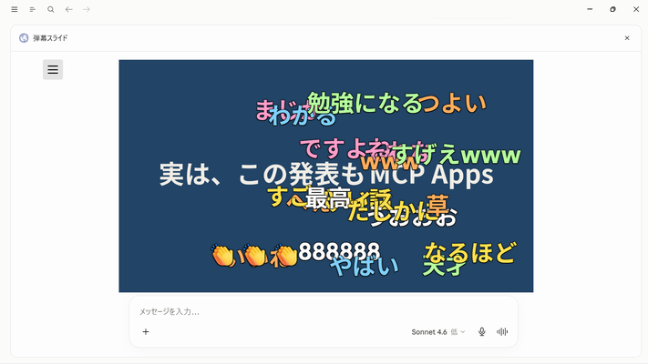

# 弾幕プレゼンMCP App

PDFスライドの上を、弾幕コメントが流れていくプレゼンアプリです。参加者は自身のスマホなどから、匿名でコメントを投稿できます。

「[MCP Appsを作ってみよう](https://speakerdeck.com/iwamot/hello-mcp-apps)」という発表のために作ったものですが、「仕組みが知りたい」「使ってみたい」との感想を頂いたため、OSSで公開することにしました。

Claude DesktopやMCPJamなど、[MCP Apps対応クライアント](https://modelcontextprotocol.io/extensions/client-matrix#support-matrix)で実行できます。



## 使い方

### 1. コメント送信フォームの準備

まず、コメント投稿用のフォームを準備します。Googleスプレッドシートを使って、以下の手順で進めればOKです。

1. 新しいGoogleスプレッドシートを作る（ファイル名は任意）
2. 下部のシート名を `comments` に変更する
3. シートの1行目に、左から「投稿日時」「コメント」「色」と入力する
4. 「拡張機能 → Apps Script」を開く
5. デフォルトの `.gs` ファイルに、[gas/Code.gs](gas/Code.gs) の内容を貼り付けて保存する
6. 「ファイル」の「+」ボタンでHTMLを追加、`form.html` にリネームし、[gas/form.html](gas/form.html) の内容を貼り付けて保存する
7. 「デプロイ → 新しいデプロイ」を開き、種類で「ウェブアプリ」を選ぶ
8. アクセスできるユーザーを「全員」に変更し、デプロイする
9. アクセスを承認し、ウェブアプリのURLをコピーする

### 2. MCPサーバーの起動

次に、Node.js 24がインストールされた環境で以下を実行し、MCPサーバーを起動します。

```
git clone https://github.com/iwamot/danmaku-slides.git
cd danmaku-slides

npm install
cp .env.sample .env  # COMMENTS_FEED_URL に「ウェブアプリのURL」を貼り付ける
npm run dev          # http://localhost:3001/mcp でMCPサーバーが起動
```

### 3. 対応クライアントとの接続

起動したMCPサーバーを、お使いのMCP Apps対応クライアントに接続します。以下、接続例です。

#### MCPJam Inspector

1. `npx @mcpjam/inspector@latest` で、MCPJam Inspectorを起動する
2. 「Connect → Add Server」を開き、接続先として `http://localhost:3001/mcp` を指定する

#### Claude Desktop

1. MCPサーバーを `ngrok http 3001` でインターネットに公開し、出力されたURLをコピーする
2. Claude Desktopの「カスタマイズ → コネクタ」で、カスタムコネクタとして `{出力されたURL}/mcp` を指定する

### 4. プレゼン

接続できたら、以下の流れでプレゼンします。

1. クライアントから `present` ツールを呼び出す（LLMに「弾幕プレゼンを開いて」と指示する）
2. 「メニュー → PDF を開く」で、プレゼンしたいPDFファイルを選択する
3. コメント投稿フォーム（ウェブアプリ）のURLを参加者に伝える
4. 「メニュー → コメント受信を開始」で、受信を開始する（コメントがあれば弾幕で流れる）
5. 「←」「→」キーでページを送り、必要に応じて「D」キーで弾幕サンプルを流す
6. 発表が終わったら、「C」キーで発表者へのフィードバックをLLMに生成させる

## MCPサーバーに含まれるツール

| ツール | 概要 |
| --- | --- |
| `present` | 弾幕プレゼンのビューを開く |
| `fetch_comments` | Googleスプレッドシートのコメントを取得する |

## ライセンス

MIT
